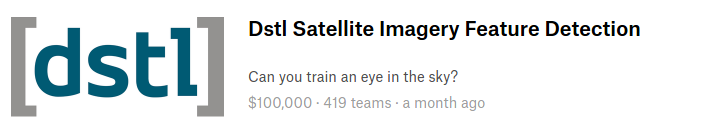
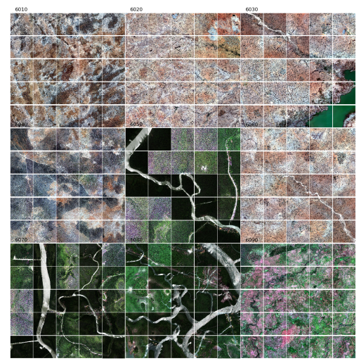
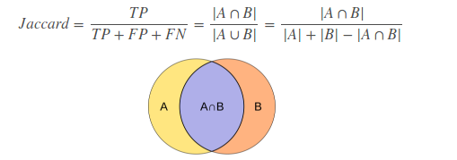
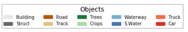
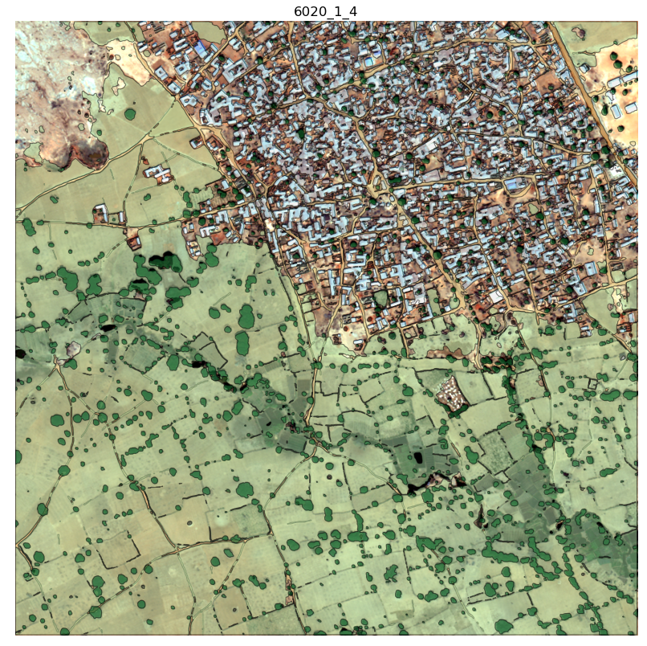
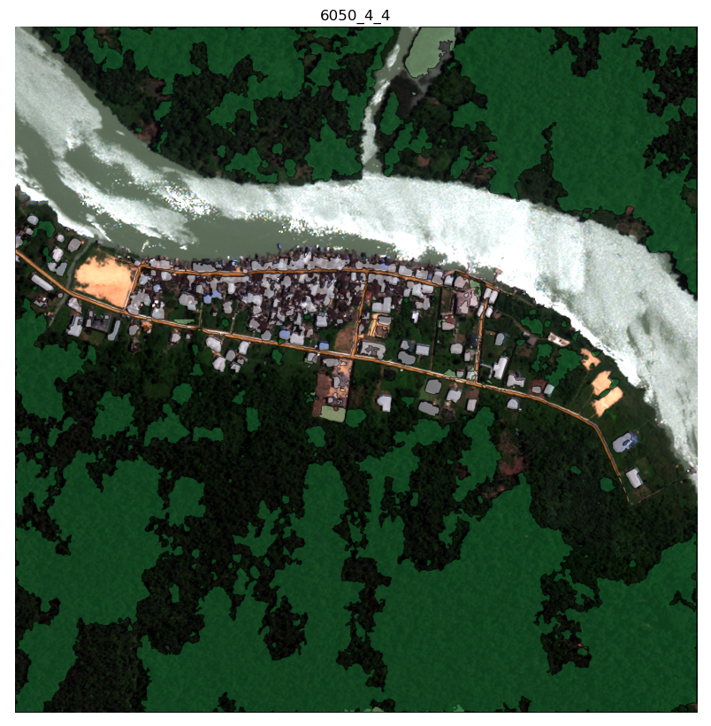
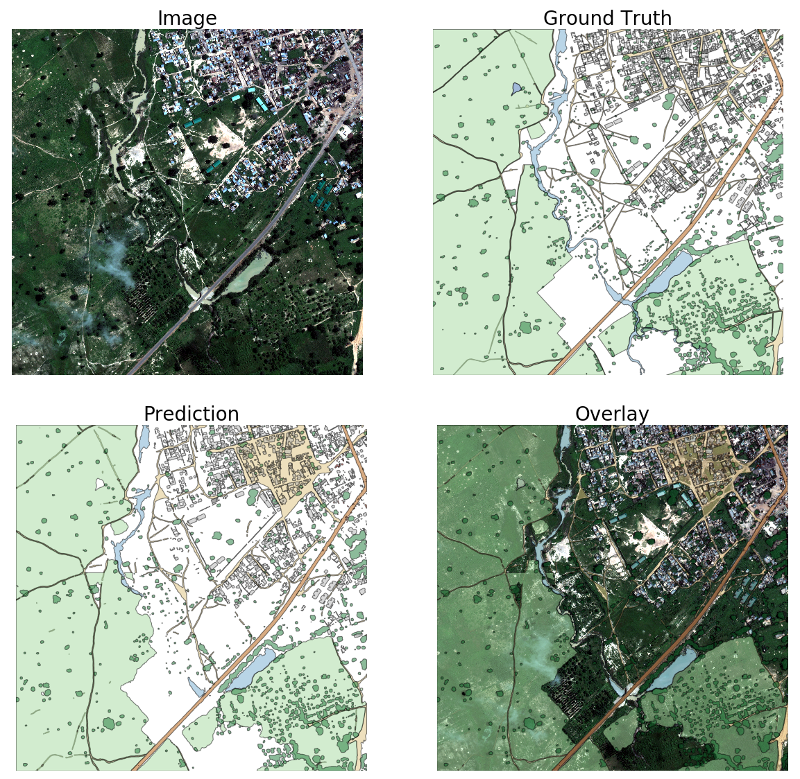
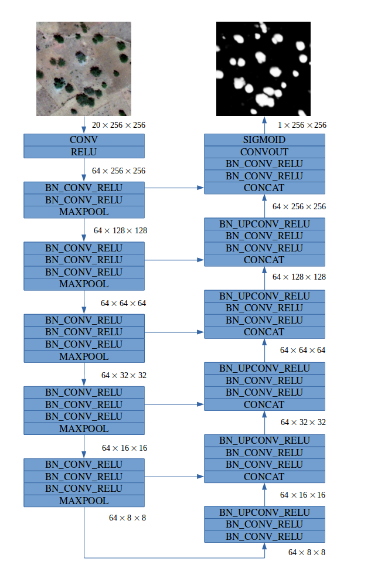
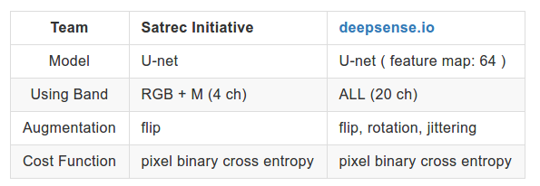

쎄트렉아이 신기술개발팀의 인턴으로 총 8주 (1월 2일 - 2월 24일)라는 기간 동안 근무 하면서 Kaggle의  [Dstl Satellite Imagery Feature Detection ](https://www.kaggle.com/c/dstl-satellite-imagery-feature-detection) 대회에 참가했던 기록입니다.

저희 팀은 419 개 팀 중, Public leaderboard (16 위), Private leaderboard (28 위)를 차지했습니다. 저희 팀은 여러 semantic segmentation 기법을 적용하였습니다.

Dstl Satellite Imagery Feature Detection(이하 DSTL Competition)은 위성영상에서 물체 인식 및 위치 검출을 목적으로 개최된 대회입니다.

한 지역을 5 x 5 의 형태로 나누어 총 18 지역에 대해서 총 10 개 클래스의 물체 인식 및 위치 검출을 시도했습니다.
- Building
- Structure
- Road
- Track
- Trees
- Crops
- Waterway
- Standing Water
- Truck
- Car

## 결과 평가
DSTL Competition의 제출 결과물은 각 클래스에 대해 영상에 나타나는 형태를 polygon으로 표현합니다. 각 polygon은 좌표의 리스트 형태로 저장되며, 모든 검출 결과를 csv 파일로 제출합니다.
제출 결과물에 대한 점수는 제출된 polygon과 ground truth의 polygon이 서로 중첩되는 영역을 이용하여 산출 되었습니다.(Jaccard Score)
각 클래스에 대해서 평가 점수가 나오며 이것의 평균이 최종 점수가 됩니다.
Public 리더보드는 테스트 데이터셋 19%를 측정한 점수이며,
Private 리더보드는 테스트 데이터셋 81%를 측정한 점수가 됩니다.

## 적용 모델
저희 팀에서는 [Fully Convolutional Networks (FCN)](https://arxiv.org/abs/1411.4038) 논문을 베이스라인으로 삼아 최종적으로 [U-net](https://arxiv.org/abs/1505.04597) 을 변형한 형태로 최종 모델을 구현하였습니다.
FCN으로 전체 클래스에 대한 예측을 진행하였고 그 결과물에 U-net의 결과를 덮어씌우면서 진행을 하였습니다.
클래스 1~6 (Building, Struct, Road, Track, Trees, Crops) 와  클래스 9~10 (Truck, Car) 를 따로 동일 구조의 네트워크 두 개를 사용하였습니다.

물과 관련된 클래스(Waterway, S.Water)는 딥러닝 네트워크 모델이 아닌  [CCCI](https://www.kaggle.com/resolut/dstl-satellite-imagery-feature-detection/waterway-0-095-lb) 라는 방법을 사용하여 검출을 하였습니다.
Waterway, S.Water의 세부적 분류는 관련 픽셀의 크기를 기반으로 분류를 하였습니다.

## 데이터 프로세싱
학습을 위한 위성이미지 밴드는 RGB와 M band 대역을 사용하였습니다.
데이터에 사용되는 값은 최대값, 최소값의 각각 2%를 잘라낸 값을 사용하였고, 이를 [-1, 1]로 Normalization 하여 처리하였습니다.
이미지를 돌리거나 뒤집는 방식으로 Augmentation을 진행하였습니다. (Tree, Crop 제외)
결과 데이터에서는 물 위에 다른 클래스를 모두 지워 제출 하였습니다.

## 학습 방법
GTX 1080 GPU를 이용하여 binary cross entropy loss function으로 모델을 학습하였습니다.
각 patch size는 RGB 640, M band 160이며 GPU 메모리의 최대 한도 까지 batch를 두어 학습하였습니다.

## 최종 결과
이렇게 해서 저희 팀은 Public 리더보드에서 0.493 (Jaccard Score)를 Private 리더보드에서 0.35377 (Jaccard Score) 로 각각 16등과 28등의 성적을 거두었습니다.

## deepsense.io과 비교
[deepsense.io](https://deepsense.io/deep-learning-for-satellite-imagery-via-image-segmentation/) 는 DSTL Competition 에서 U-net을 기반으로 Private 리더보드 4위를 한 팀으로 유사한 점이 많습니다.

### Team 간 비교

이들은 각 클레스에 대해 네트워크를 학습하였으며
특이 점으로는 feature map의 크기를 64로 고정해서 가저가는 점입니다.
그 이유는 이들이 서술하기로 위성영상에 있어 깊은 레이어 까지 내려갈 필요가 없어 상위 레이어의 성능을 위해 고정하였다고 하고
또한 다운 샘플링 과정에서 약간의 정보를 잃게 하여 업 샘플링 과정에서 low level feature에 접근 가능하다고 합니다.

Water 클래스의 경우
random forest로 20 밴드를 돌려 높은 성능이 나왔다고 합니다 이는 물의 교유한 성질 때문이라고 합니다.

Car 클래스의 경우는 차량의 수가 적어 이를 해결하기 위해
RGB + Panchromatic 채널과 20개 채널의 앙상블을 사용하여 네트워크를 따로 구성해 학습하였다 합니다.

## 개인적인 회고
팀원 분들과 DSTL Competition를 진행 하면서 가장 좋았던 것은 내 의견을 자유롭게 낼 수 있고
그것이 실제로 반영되었다. 시작하는 팀이라 같이 다양한 것을 시도 할 수 있어서 좋았다.
데이터 처리에 대한 전체 파이프라인을 설계하고 그것을 구현하는것이 나에게는 처음하는 경험이고
그것을 통해 재미를 느꼈다. 또한 학교에서 CPU로 꾸역꾸역 돌리던 것을 GPU로 돌릴 때의 쾌감은 아직도 잊혀지지 않는다.
그렇기에 나에게 8주라는 기간이 너무나도 짧아 아쉬웠다. 실수를 좀 더 줄이고 시간을 아꼈더라면 더 좋은 결과물을 낼 수 있지 않았을까 아쉬움이 든다.

이런 좋은 경험을 만들어주신 우리 쎄트렉아이 신기술개발팀 팀원 분들께 감사드립니다.
