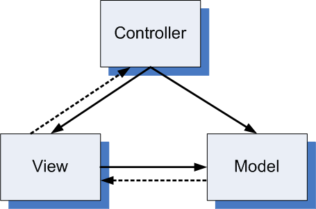

Model-View-Controller ( MVC ) 는 소프트웨어 공학에서 사용되는 디자인 패턴이다.
프로그램 구조를 더 쉽게 유지하고 수정하기 위해 프로그램을 Model, View, Controller로 나누어 개발 하는 것이다.

Controller는 Model과 View를 관리한다. Model은 직접적인 알고리즘과 데이터를 관리한다.
View는 Model 이 생성한 데이터를 사용자에게 보여주는 역활을 하지만, Controller 를 통하여 데이터를 받고
직접 데이터에 접근하지 않는다. 이것이 MVC Pattern 의 핵심이다.

# Model
Model 은 프로그램의 핵심적인 부분으로 View 와 Controller 에 독립적이다.
데이터를 수정하고 조작하는 메소드가 있으나, 이것을 시각화 하는 기능은 없다.
그렇기에 로직을 유지하면서 View나 Controller를 개발 및 유지보수가 가능하다.
모델은 데이터 무결성을 책임진다.

[learning python design patterns](https://www.google.co.kr/webhp?sourceid=chrome-instant&ion=1&espv=2&ie=UTF-8#newwindow=1&safe=off&q=learning+python+design+patterns&stick=H4sIAAAAAAAAAONgecToyS3w8sc9YSmHSWtOXmO04uIKzsgvd80rySypFNLhYoOylLgEpHj00_UNK3NMjYwtCk00GKT4uFBEeACX-0VxTgAAAA)
에서는 모델 작업을 할 때 다음과 같은 조언을 한다.

- 데이터 모델을 생성하고 이를 다루는 인터페이스를 만든다.
- 데이터를 검증하고 에러를 Controller에 보고한다.
- 유저 인터페이스를 직접 다루지 않는다.

# View
View 는 말 그대로 Model 이 생성한 데이터를 Controller 에게 받아  보여주는 역활을 한다.
어려운 로직이 아닌, 간단한 비교문 등으로 구성된다. DB에 직접 접근이나, 어려운 로직을 가지는건
Model 이 하는 일이다. 최대한 간결함이 포인트다.

# Controller
Controller는 Model 과 View 의 연결 통로 쯤으로 Model 에게 데이터나 연산을 요청하고,
View 에게 전달하는 역활을 맡는다. 데이터를 표시하거나, DB의 접근은 Controller 의 일이 아니다.
대신 요청의 에러나, Model 에게 보고받은 에러들을 담당하여 처리한다.

# MVC Pattern 의 장점

MVC Pattern 을 이용하면 다음과 같은 장점이 있다.

- 각 역활을 분리하여 놨기에 이해가 쉽고 각 부분간 의존성이 낮다
- 여러 개발자와 같이 일한다면, 역활 분담을 하기 쉽다
- 로직을 수정하지 않고 UI를 변경 할 수 있다 ( UI 수정을 하지 않고 로직을 변경 할 수 있다 )
