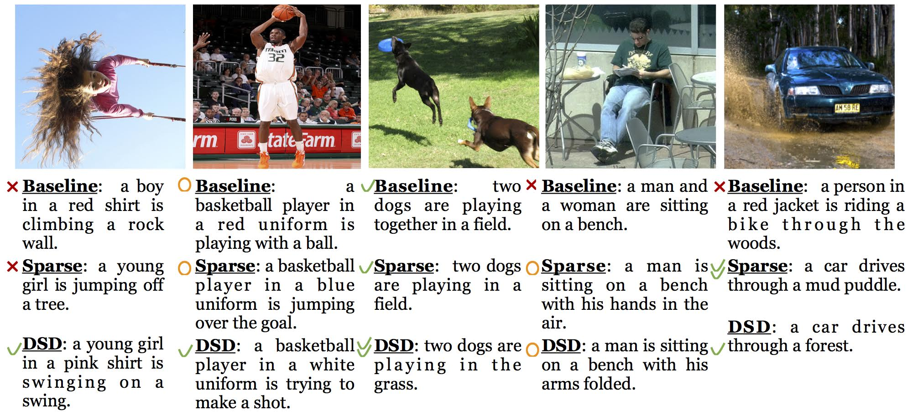

 

Song Han 이  2016년 11월 10일에 쓴
[Compressing and regularizing deep neural networks](https://www.oreilly.com/ideas/compressing-and-regularizing-deep-neural-networks)
를 번역한 포스팅 입니다. 기존 네트워크들이 수 백 MB를 차지 하던 메모리를 최대 49 배 압축하면서
정확도는 떨어지지 않았습니다. 오역 및 의역이 있을 수 있습니다.

딥 뉴럴 네트워크는 컴퓨터 시각 및 음성 인식에서부터 자연 언어 처리에 이르는
기계 학습 과제를 위한 최첨단 기술로 진화 해 왔습니다.
그러나 이런 알고리즘은 연산과 메모리를 많이 사용함으로
하드웨어 리소스가 제한되어있는 임베디드 시스템에 사용하기가 어렵습니다.
이를 해결하기 위해 `Deep Compression`은 네트워크에 필요한 연산 및 메모리를 크게 줄입니다.

예를 들어, Alexnet 및 VGGnet과 같이 FC ( Fully Connected ) layer를 사용하는
CNN (Convolutional Neural Networks) 모델의 경우 모델 크기를 35 배 - 49 배 까지 줄일 수 있습니다.
GoogleNet 또는 SqueezeNet과 같은 FCN ( Fully Convolutional Neural Networks ) 모델의
경우에도 압축률을 높이면 모델 크기가 10배 까지 줄어 듭니다. 두 시나리오 모두 정확도를 잃지 않습니다.

# 현재의 트레이닝 방법은 부적절 하다
압축 `(Deep Compression)` 이 정확성을 잃지 않는것은 훈련 된 모델에 상당한 중복성이 있음을 의미합니다.
이는 트레이닝 방법의 부적절 함을 표현합니다.
이 문제를 해결 하기 위해 저는 NVIDIA 의 Jeff Pool, Biaidu 의 Sharan Narang,
Facebook의 Peter Vajda와 협력하여 Dense-Sparse-Dense (DSD)
[[논문](https://arxiv.org/abs/1607.04381)] 트레이닝 방법을 개발 했습니다.
새로운 트레이닝 방법은 먼저 희소성이 제한(sparsity-constrained)된 최적화를 통해 모델을 정규화합니다.
그리고 잘라낸 가중치의 복구 및 재 훈련을 통해 정확도를 향상 시킵니다.

테스트 타임에 DSD 교육을 통해 만들어진 최종 모델은 원래의 모델과 동일한 아키텍처 및 차원을 유지하며
DSD 교육은 inference에 대한 오버 헤드가 발생하지 않습니다.

우리는 이미지 분류, 이미지 캡션 및 음성 인식을 위해 주로 CNN / RNN / LSTM 에 DSD 교육을 실험했으며
상당한 성능 향상을 발견했습니다. 이 [논문](https://arxiv.org/abs/1607.04381) 에서는 우선 `Deep Compression` 을 도입 한 다음 DSD 트레이닝을 소개합니다.

# Deep compression
`Deep compression` 의 첫 번째 단계는 가지 치기(pruning)입니다.
인간의 두뇌는 본질적으로 가지 치기의 과정을 가지고 있습니다.
[5분의 1의 시냅스가 유아기부터 성인기까지 가지 치기됩니다](https://en.wikipedia.org/wiki/Synaptic_pruning?).  

유사한 규칙이 인공 신경망에도 적용될까요? 대답은 '네' 입니다.
초기 네트워크 가지 치기는  네트워크 복잡성과 오버피팅을 줄이기위한 유효한 방법임이 입증되었습니다.
이 방법은 최근의 신경 네트워크에서도 작동합니다.
우리는 일반적인 트레이닝을 통해 학습하는 것으로 시작합니다.
다음으로, 가중치가 작은 연결을 제거합니다.
임계 값 미만의 가중치를 가진 모든 연결이 네트워크에서 제거됩니다.
마지막으로 네트워크를 재 훈련하여 나머지 희소 연결에 대한 최종 가중치를 학습합니다.
가지 치기는 AlexNet 및 VGG-16 모델의 경우 매개 변수 수를 9 배 - 13 배 줄였습니다.

   
 [그림 1] 네트워크 가지 치기 모든 이미지의 저작권은 *Song Han* 에게 있습니다. 

`Deep compression` 의 다음 단계는 가중치를 공유 하는 것 입니다.
우리는 신경망이 낮은 정밀도에 대한 높은 내성을 가지고 있음을 발견했습니다:
가중치를 근사하여도 정확도가 떨어지지는 않습니다.

그림 2에서 볼 수 있듯이 파란색 가중치는 원래 2.09, 2.12, 1.92, 1.87입니다.
4 개가 같은 값인 2.00을 공유하게함으로써 네트워크의 정확성을 여전히 회복 할 수 있습니다.
따라서 우리는 매우 적은 가중치를 구할 수 있고, 이를 `codebook` 이라고 부르며,
다른 많은 가중치가 동일한 가중치를 공유하도록 허용하여 코드북에 인덱스 만 저장합니다.

인덱스는 매우 적은 비트로 나타낼 수 있습니다.
예를 들어, 아래 그림에서 4 가지 색상이 있으므로 원래 32 비트가 아닌 2 비트 만
가중치를 나타내는 데 필요합니다. 반면에 코드북은 매우 작은 저장 공간을 차지합니다.
우리의 실험은 이러한 종류의 가중치 공유 기법이 압축 정도와 정확도 측면에서
선형 양자화 ( linear quantization ) 보다 낫다는 것을 발견했습니다.

   
 [그림 2] 트레이닝 중 가중치 공유 

그림 3은 전체 압축 결과를 보여줍니다. Lenet-300-100 및 Lenet-5는 MNIST 데이터 세트에서 평가되는 반면
AlexNet, VGGNet, GoogleNet 및 SqueezeNet은 ImageNet 데이터 세트에서 평가됩니다.
압축 비율은 10 배에서 49 배까지 다양합니다.
GoogleNet 및 SqueezeNet과 같은 FCN 이라 할지라도 `Deep compression`은 여전히
모델을 압축 할 수 있습니다.
우리는 AlexNet보다 50 배 적은 매개 변수를 가지지 만
동일한 정확도를 갖는 SqueezeNet을 중점으로 여전히 10배로 압축하여 470KB 로 만들 수 있습니다.
따라서 DRAM보다 액세스가 빠르며 에너지 효율이 높은 on-chip SRAM에 쉽게 맞출 수 있습니다.

우리는 낮은 순위 근사법과 같은 다른 압축 방법을 시도해 왔지만 압축 비율은 그다지 높지 않습니다.
전체적인 연구는 [`Deep Compression 논문`]('https://arxiv.org/pdf/1510.00149v5.pdf')
에서 찾을 수 있습니다.

  
 [그림 3] Deep Compression 결과 

# DSD training
딥 뉴럴 네트워크를 압축 할 수 있다는 사실은 현재의 교육 방법에 몇 가지 한계가 있음을 의미합니다.
가장 작은 local minim 를 찾기 위해 모델의 전체 용량을 충분히 활용할 수는 없지만
훨씬 적은 시냅스를 가지는 가지를 잘라내어 만들어진 스파스(sparse) 모델은 동일한 정확도를 달성 할 수 있습니다. 이것은 다음과 같은 의문을 이끌어 냅니다: 우리는 그 가중치를 복구하고 다시 학습하여 더 나은 정확성을 얻을 수 있는가?

올림픽에서 경주를 위한 훈련에 비유 해 봅시다.
코치는 우선 낮은 산소, 추운 날씨 등 많은 제약이있는 높은 고도의 산에서 선수를 훈련 할 것입니다.
결과는 주자가 다시 트랙으로 돌아올 때 속도가 증가한다는 것입니다.
뉴럴 네트워크도 마찬가지로 엄격하게 제한된 sparse 트레이닝이 주어지면 네트워크는 밀집된 모델과
마찬가지로 성능이 향상됩니다. 제약 조건을 해제하면 모델이 더 잘 작동 할 수 있습니다.

이론적으로 DSD 교육의 효과에 기여하는 요인은 다음과 같습니다:

1. **Escape Saddle Point**: 딥 네트워크를 최적화 할 때 가장 큰 어려움 중 하나는
[Saddle Point](https://arxiv.org/pdf/1406.2572.pdf)의 확산 입니다.
DSD 트레이닝은 가지 치기 와 고밀도 프레임 워크를 통해 saddle point을 극복합니다.
수렴된 모델의 가지 치기는 학습을 혼란스럽게하고 네트워크가 saddle point을 뛰어넘을
수 있게하여 네트워크가 더 나은 로컬 또는 글로벌 minimum으로 수렴 할 수 있습니다.
이 아이디어는 [Simulated Annealing](https://en.wikipedia.org/wiki/Simulated_annealing)
과 유사합니다.
Simulated Annealing 은 검색 그래프에서 확률이 줄어들면서 무작위로 점프하는 반면,
DSD는 작은 가중치를 제거하고 희소성 지원을 실시하여 첫 번째 고밀도 트레이닝 단계에서
달성 된 수렴형 솔루션에서 결정론적으로 벗어납니다.

2. **Regularized and Sparse Training**: sparse 트레이닝 단계에서 희소성 정규화는
 loss surface이 더 매끄럽고 잡음에 잘 견디는 경향이 있는 lower-dimensional space로
 optimization를 이동시킵니다. 수 많은 실험은 sparse 트레이닝과 DSD 모두 분산을 줄이고
 오류를 낮추는 것으로 입증되었습니다.

3. **Robust re-initialization**: [가중치 초기화](https://arxiv.org/pdf/1511.06422v7.pdf)
는 딥 러닝에서 큰 역할을 합니다. 기존 트레이닝에서는 초기화의 기회가 한번 뿐입니다.
DSD는 트레이닝 과정에서 optimization 에게 보다 강력한 sparse 트레이닝 솔루션에서1. **Initial dense training**:
다시 초기화 될수 있는 기회를 제공합니다. 가지 치기한 가중치에 대한 제로 초기화로 볼 수 있는Sparse 솔루션에서 네트워크가 다시 Dense 해집니다. 다른 초기화 메소드도 시도해 볼 가치가 있습니다.

4. **Break Symmetry**: 히든 유닛의 순열 대칭은 가중치를 대칭으로 만듭니다,
따라서 트레이닝에서 같이 적응(adaptation)을 하는 경향이 있습니다.
DSD에서 가중치를 제거하면 가중치와 관련된 히든 유닛의 대칭성이 깨지며
최종 dense 단계에서는 가중치가 비대칭 됩니다.

우리는 이미지 분류, 이미지 캡션 및 음성 인식 데이터 세트에 대한 몇 가지 주류 CNN / RNN / LSTM 아키텍처
를 연구하여 DSD 트레이닝 플로우가 상당한 정확도 향상을 제공함을 발견했습니다.

우리의 DSD 트레이닝은 3 단계 프로세스를 사용합니다 : Dense 하고, Sparse 하고, 다시 Dense하고;
각 단계는 그림 4에 나와 있습니다.

  
 [그림 4] Dense-Sparse-Dense 학습 플로우 

1. **Initial dense training**: 첫 번째 단계는 Dense 한 네트워크에서 정상적인 네트워크 교육을 통해 연결을 학습합니다.
그러나 기존의 트레이닝과는 달리이 D step의 목표는 가중치의 최종 값을 배우는 것이 아닙니다.
오히려 우리는 어떤 연결이 중요한지를 배우고 있습니다.

2. **Sparse training**: S step은 낮은 가중치의 연결을 제거하고 sparse 네트워크를 다시 트레이닝 합니다.
우리는 우리의 실험에서 모든 레이어에 대해 sparsity 를 적용했으므로 단일 하이퍼 매개 변수에 sparse가 있습니다.
각 계층에 대해 매개 변수를 정렬하고 가장 작은 N * sparse 매개 변수가 네트워크에서 제거되어 dense한 네트워크를
Sparse 네트워크로 변환합니다.

3. **Final Dense Training**: 마지막 D step 은 가지 치기된 된 연결을 복구하여 네트워크를 다시 dense 하게 만듭니다.
이전에 가지 치기된 연결은 0으로 초기화되고 다시 트레이닝 됩니다.
가지 치기된 연결을 복원하면 네트워크의 차원이 증가하고 매개 변수가 많아지면
네트워크가 더 나은 로컬 미니멈에 도달하기 위해 Saddle Point을 아래로 내리기 더 쉬워집니다.

우리는 서로 다른 도메인의 데이터 세트를 다른 종류의 뉴럴 네트워크에 DSD 트레이닝을 적용했습니다.
우리는 DSD 트레이닝을 통해 DSD 트레이닝을 받지 않은 신경망에 비해
이러한 **모든 네트워크의 정확도가 향상되었음** 을 발견했습니다.
뉴럴 네트워크는 CNN, RNN, LSTM 등을 사용했습니다.
데이터 세트는 이미지 분류, 음성 인식 및 자막 생성 분야 데이터를 사용했습니다.
결과는 그림 5 에 나와 있습니다. DSD 모델은 [DSD Model Zoo](https://songhan.github.io/DSD/)
에서 다운로드 할 수 있습니다.

 [그림 5] DSD 트레이닝은 정확도를 향상시킵니다. 

# 이미지 캡션 Generating
DSD 트레이닝이 이미지 캡션 작업에 미치는 영향을 시각화했습니다 (그림 6 참조).
이미지 캡션을 Generating 하는 LSTM 모델 인 [NeuralTalk](http://cs.stanford.edu/people/karpathy/cvpr2015.pdf)
에 DSD를 적용했습니다. 기본 모델은 이미지 1, 4 및 5를 설명하지 못 하였습니다.
예를 들어 첫 번째 이미지에서 기본 모델은 소녀를 소년으로 착각하고 소녀의 머리카락을 암벽으로 착각합니다.
sparse 모델은 이미지에 있는 소녀 임을 알 수 있으며 DSD 모델은 스윙을 더 식별 할 수 있습니다.

두 번째 이미지에서, DSD 트레이닝 방식은 플레이어가 샷을 하려고 한다는 아는 반면, 기본 모델은 단지 공을 가지고 논다고 하였습니다.
재미있는 경우는 DSD 모델보다 sparse 모델이 더 잘 작동하는 경우가 있다는 것 입니다.

마지막 이미지에서 sparse 모델은 진흙 웅덩이를 올바르게 캐치한 반면 DSD 모델은 배경에서 숲만 캐치했습니다.
DSD 트레이닝의 우수한 성능은 이러한 예를 넘어서서 일반화되며 DSD 교육으로 생성 된 더 많은 이미지 자막결과는
이 [논문](https://arxiv.org/abs/1607.04381) 에서 제공됩니다.

 [그림 6] DSD 트레이닝은 이미지 캡션의 성능을 향상시킵니다. 

# sparsity 의 장점
딥 뉴럴 네트워크를 압축하기위한 `Deep Compression`와
신경 네트워크를 정규화 하기위한 DSD 교육은 sparsity 를 사용하여
작은 크기와 더 높은 정확도를 달성하는 기술입니다.

모델 크기와 예측 정확도를 제외하고 sparsity를 이용하는 두 가지의 방향으로
속도와 에너지 효율성과 같은 내용을 살펴보았으나 이는 이 아티클의 범위를 벗어납니다.
더 자세한 내용을 보려면 [EIE](https://arxiv.org/pdf/1602.01528v2.pdf)를 참조 할 수 있습니다.
